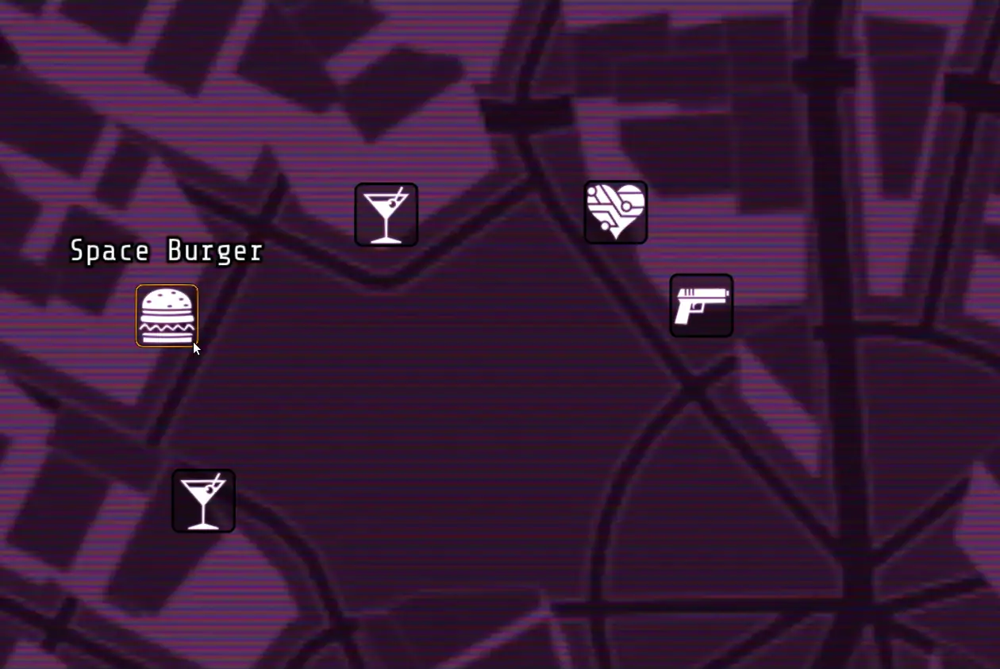
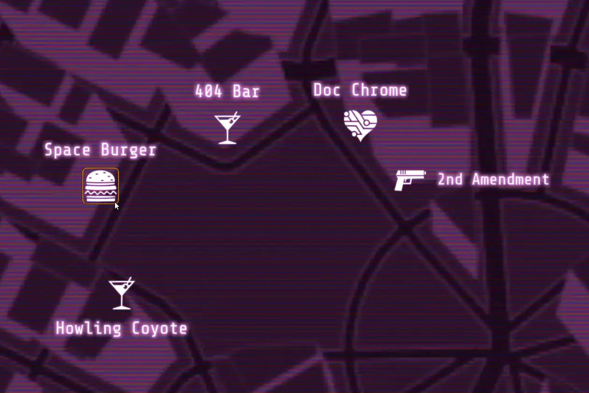

# More Pin Options (Foundry VTT Module)

This module adds some configuration options for map note pins:

- hide the background that Foundry automatically adds to a map note
- always show the tooltip text, not just on hover
- configure text styling options: drop shadow and stroke

## Installation

https://github.com/neovatar/more-pin-options/releases/latest/download/module.json

See [Foundry Wiki - How to install a module](https://foundryvtt.wiki/en/basics/Modules) on help on how to use the manifest URL to install a module.

## Example

This is an example what you can do with this module.

Basic Foundry map notes:

Map notes using this module:
